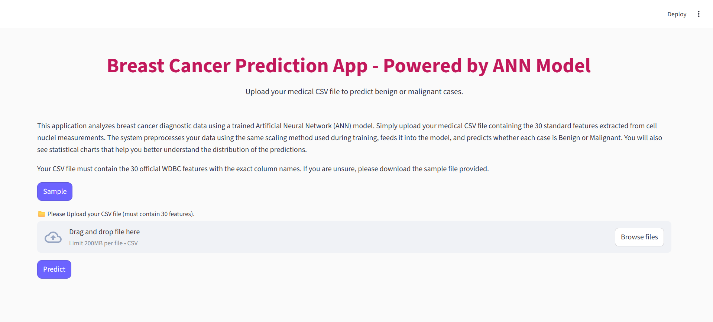
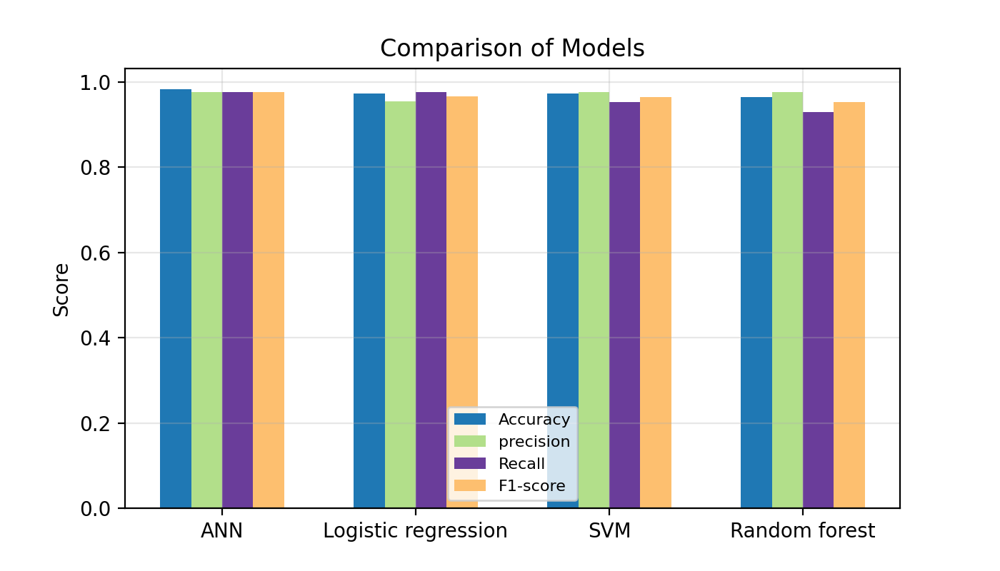

# Breast Cancer Prediction App - Powered by ANN Model
An Interactive Machine Learning Application for Breast Tumor Classification
___

## Overview
This project is a complete end-to-end Machine Learning project for predicting whether a breast tumor is Benign or Malignant based on medical diagnostic features from the Wisconsin Breast Cancer Dataset (WDBC).

The system includes:

- Full EDA
- Preprocessing & Feature Engineering
- Model Training & Evaluation
- Comparison of Multiple ML Models
- Exporting Best Model & Scaler
- A fully interactive Streamlit Web Application
- Statistical charts (Plotly) & downloadable results

## 📌Key Features

- EDA Notebook with visualizations
- Preprocessing steps (scaling, cleaning, transformations)
- Model Training Notebook testing multiple algorithms
- Automatic best-model selection
- Saving the ANN model & Scaler using joblib
- A modern Streamlit Web App with:

    - File upload
    - Automatic preprocessing
    - Prediction output
    - Clean UI + Styled Buttons
    - Statistical visualization (Plotly Bar Charts)

## Project Structure

```
Breast-Cancer-Prediction-WebApp/
│
├── data/
│   ├── wdbc.csv                # Raw dataset
│   ├── processed.csv           # Cleaned dataset
│   ├── wdbc.names              # Dataset Documentation
│   ├── x_train_df.csv
│   ├── x_test_df.csv
│   ├── y_train_df.csv
│   ├── y_test_df.csv
│   └── results/
│       ├── metrics_results.csv  # Evaluation metrics for all models
│       └── metrics_plot.png     # Bar chart of model performance
│
├── notebooks/
│   ├── 01_eda.ipynb
│   ├── 02_preprocessing.ipynb
│   └── 03_model_training.ipynb
│
├── pkl/
│   ├── scaler.pkl
│   └── best_model_ANN.pkl
│
├── src/
│   ├── 01_eda_preprocess.py
│   └── 02_model_training.py                
│
├── app.py                    # Main Streamlit application
├── LICENSE
├── requirements.txt
└── README.md
```
## Technologies Used
- **Python 3.11** 
- Scikit-Learn
- NumPy
- Pandas
- Matplotlib
- Plotly
- joblib
- Streamlit
- Jupyter Notebook

## Modeling & Evaluation
Multiple models were trained and compared, including:

- Logistic Regression
- Random Forest
- SVM
- Artificial Neural Network (ANN)



The final selected model (based on Recall, F1-score, Accuracy) was:

### Artificial Neural Network (ANN) ✨
saved inside:
```
pkl/best_model_ANN.pkl
pkl/scaler.pkl
```
## Web Application
The Streamlit app provides:

- Modern UI with custom CSS
- Uploading CSV files
- Automatic preprocessing with the same scaler
- Running prediction using the trained ANN model
- A result summary with:
    - Tumor Type (Benign / Malignant)
    - Statistical bar chart of class distribution

## Preview


## Data Sources 

[Wisconsin Diagnostic Breast Cancer (WDBC) dataset](https://archive.ics.uci.edu/dataset/17/breast+cancer+wisconsin+diagnostic)

## License 
[@MIT](LICENSE)

## Author
Mahshid